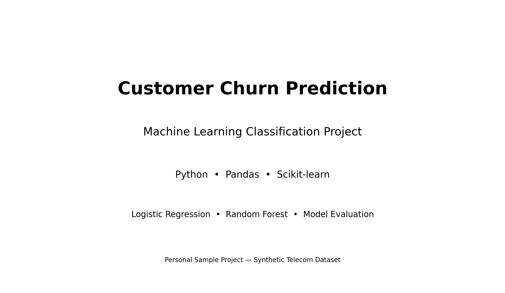
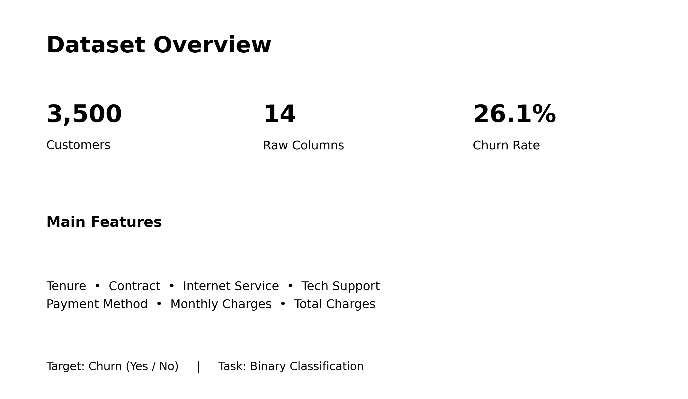
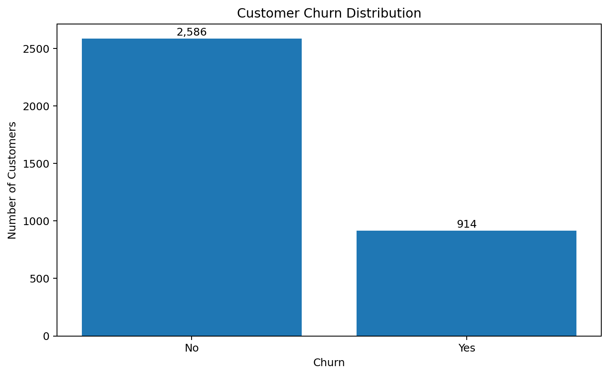
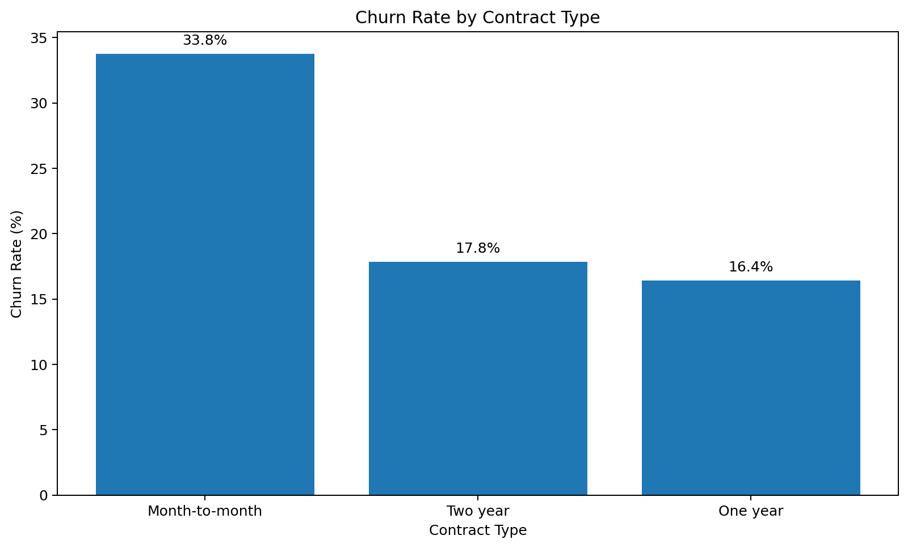
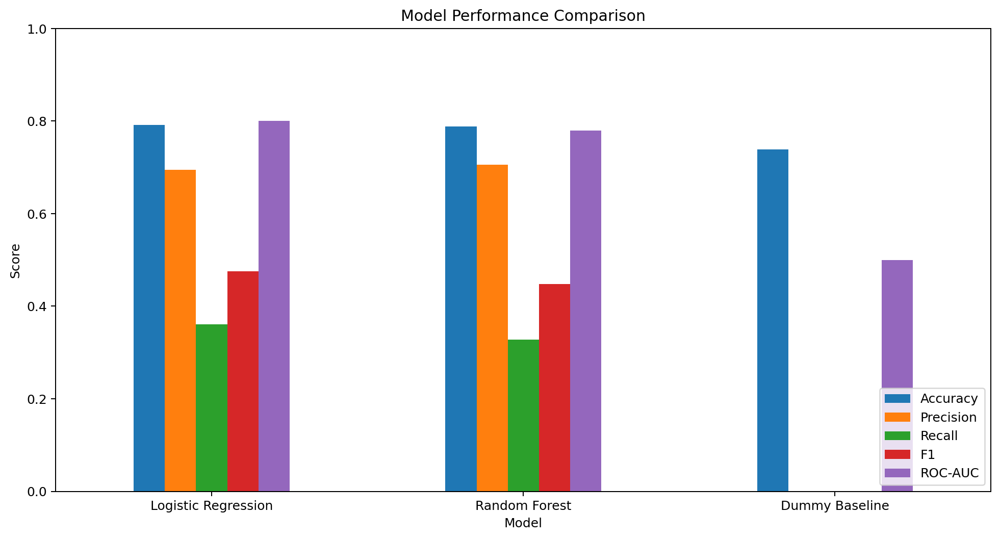
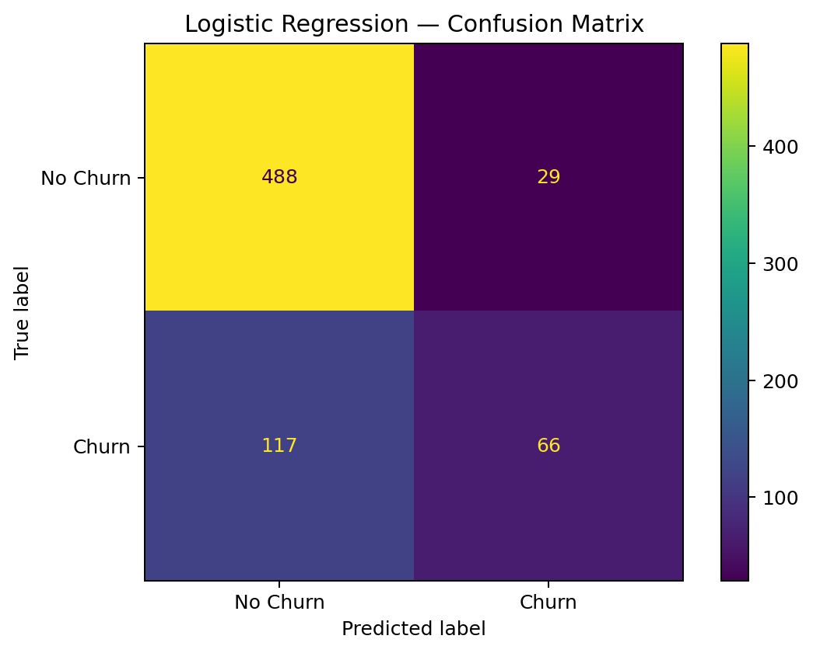
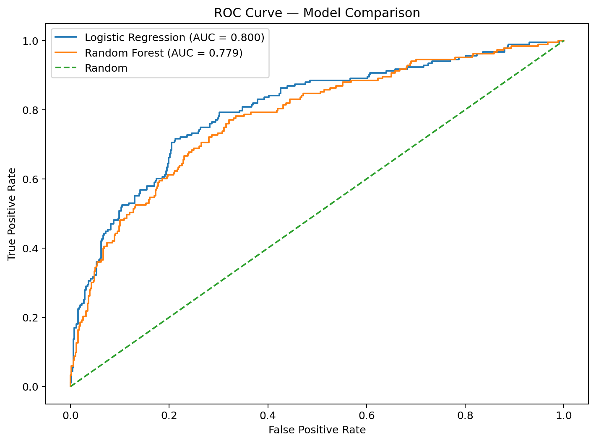
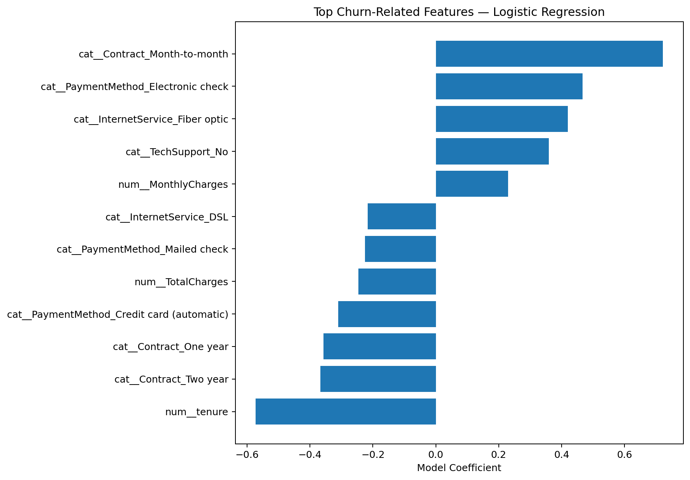

# Customer Churn Prediction

An end-to-end machine learning classification project for predicting telecom customer churn using data preprocessing, Logistic Regression, and Random Forest.

The project focuses not only on model accuracy, but also on evaluating how useful the predictions are for identifying customers at risk of churn.



---

## Project Overview

Customer churn is an important problem for subscription-based businesses because retaining existing customers can be more valuable than acquiring new ones.

The goal of this project is to build a reproducible machine learning workflow that:

- Explores and prepares customer data.
- Handles numerical and categorical features.
- Trains multiple classification models.
- Compares them against a simple baseline.
- Evaluates performance using metrics beyond accuracy.
- Identifies limitations and possible areas for improvement.

---

## Dataset

The project uses a synthetic telecom customer dataset containing **3,500 customer records**.

The dataset includes customer information such as service usage, contract details, charges, and other attributes used to predict whether a customer will churn.



---

## Exploratory Data Analysis

Before training the models, I explored the dataset to better understand the target variable and important customer patterns.

### Churn Distribution



### Churn by Contract Type



---

## Data Preprocessing

The preprocessing workflow was implemented using Scikit-learn pipelines to keep the training process organized and reproducible.

### Numerical Features
- Missing values handled using median imputation.
- Numerical features standardized using `StandardScaler`.

### Categorical Features
- Missing values handled using most-frequent imputation.
- Categorical variables transformed using `OneHotEncoder`.

The dataset was divided using an **80/20 stratified train-test split** to maintain the original churn distribution.

---

## Models

Three models were evaluated:

1. **Dummy Classifier** — baseline model.
2. **Logistic Regression**
3. **Random Forest**

The dummy classifier provides a simple reference point to determine whether the machine learning models actually learn useful patterns from the data.

---

## Model Results

| Model | ROC-AUC |
|---|---:|
| Dummy Baseline | 0.500 |
| Logistic Regression | **0.800** |
| Random Forest | 0.779 |

Logistic Regression achieved the strongest ranking performance among the tested models.



---

## Logistic Regression Evaluation

At the default classification threshold, Logistic Regression achieved approximately:

| Metric | Score |
|---|---:|
| Accuracy | 79.1% |
| Precision | 69.5% |
| Recall | 36.1% |
| F1 Score | 47.5% |
| ROC-AUC | **0.800** |

Although the model achieved a good ROC-AUC score, recall remained relatively low.

This means that the model still misses a significant number of customers who actually churn.

### Confusion Matrix



---

## ROC Curve

The ROC curve compares the ability of Logistic Regression and Random Forest to distinguish between churned and non-churned customers.



Logistic Regression achieved an AUC of approximately **0.80**, while Random Forest achieved approximately **0.78**.

Both models performed better than the random classifier baseline.

---

## Feature Importance

Random Forest was also used to explore which features contributed most to model predictions.



---

## Key Insight

A high accuracy or ROC-AUC score does not automatically mean that a classification model is ready for real-world use.

In this project, Logistic Regression produced the best ROC-AUC score, but recall at the default threshold was only about **36%**.

For a churn prediction system, missing customers who are actually going to churn can be costly. Therefore, threshold selection and business objectives should be considered alongside traditional evaluation metrics.

---

## Technologies Used

- Python
- Pandas
- NumPy
- Matplotlib
- Scikit-learn
- Google Colab

---

## Project Structure

```text
Customer-Churn-Prediction/
│
├── customer_churn_prediction.ipynb
├── customer_churn_raw.csv
├── model_results.csv
├── README.md
│
└── portfolio_images/
    ├── 01_project_cover.png
    ├── 02_dataset_overview.png
    ├── 03_churn_distribution.png
    ├── 04_churn_by_contract.png
    ├── 05_confusion_matrix.png
    ├── 06_model_comparison.png
    ├── 07_roc_curve.png
    └── 08_feature_importance.png
